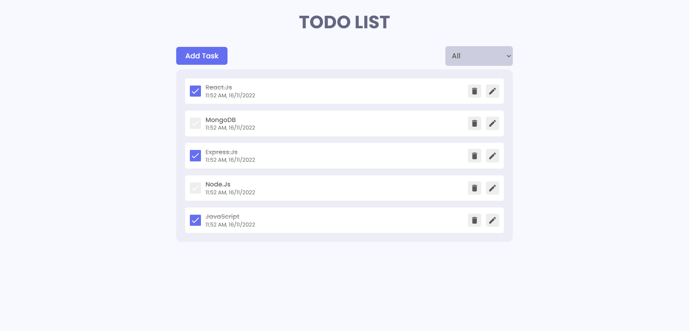

# React Todo App.



A complete Todo-App with all features.

**live demo: [https://my-todoslist-app.netlify.app.app/](https://my-todoslist-app.netlify.app/)**

---

## Project Description

In the project, we will be creating a Complete Todo Application with all features. We will do all the CRUD operations. We will to use `React.js` and to manage our states, we will use `Redux`. Also we will learn to make simple animations using `Framer Motion`.

## What we are going to use

- [React](https://reactjs.org/)
- [React Redux](https://redux.js.org/)
- [Framer Motion](https://framer.com/motion/)
- [React icons](https://react-icons.netlify.com/)
- [React Hot Toast](https://react-hot-toast.com/)

## Requirements

- Basic ReactJs knowledge
- Basic HTML, CSS knowledge

Installing React-App

```shell
npm install create-react-app
```

and after that start the dev server.

```shell
npm start
```

## Tools Used

1. Favicon: [Flaticon.com](https://www.flaticon.com/)
1. Code Editor: [VS Code](https://code.visualstudio.com/)

---

Happy Coding! 🚀
